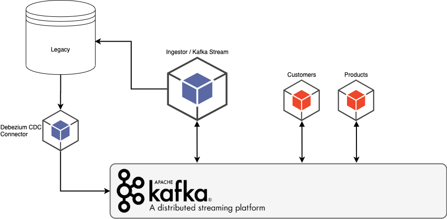
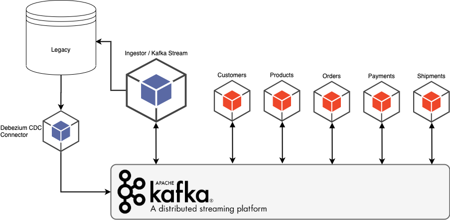

# Modernization with Stream Processing and Event-Driven Architecture

<!-- Modernize the legacy system with stream processing and event-driven architecture.
 -->
The purpose of this project is to demonstrate the modernization of a legacy system into an Event-Driven microservices architecture.

## Requirements
Legacy system must be running all the time during this the modernization effort and both legacy and modernized data stores must be sync.

## Legacy System
Our sample legacy system has 5 units: Customers, Products, Orders, Payments, and Shipping.

### Diagram
In this diagram, we can see the a Web Server handles user requests by communicating with intermediate and data layers:


### Database
The database is MySQL and contains 7 tables:
1. customers
2. categories
3. products
4. orders
5. order_items
6. payments
7. shipping

## Modernized System

Microservices:


## What to do
Now that we have the vision and goals in place, let's discuss about `how`! These are the steps that we need to make in order to achieve a successful and seamless transition from `legacy` to `modernized` system:
1. Event Storming and Modeling
2. Legacy `Debezium` Change Data Capture - CDC Connector
3. Modernized Microservices Implementation:
    1. Product
    2. Customer
    3. Order
    4. Payment
    5. Shipping

4. `Debezium` for each Microservice
5. `Ingestor` Microservice Implementation

### 1. Event Storming and Modeling
This technic let us to understand the existing system and with the discussions with stakeholders/clients/users, we can determine the most valuable domain to start and learn the `events` that needs to be created for that domain. Continue the process for next most valuable domain as needed.
In our example I determined 5 `domains` as the legacy business units: Product, Customer, Order, Payment, and Shipping. Here as an example, I want it to start with `Product` microservice (domain).

### 2. Legacy Debezium - Stream Changes from the Database
[Debezium](https://debezium.io/) is an open source distributed platform for change data capture. Start it up, point it at your databases, and your apps can start responding to all of the inserts, updates, and deletes that other apps commit to your databases. Debezium is durable and fast, so your apps can respond quickly and never miss an event, even when things go wrong.

Now that we have the starting point, we need to setup `Debezium` [connector](./connectors/legacy-mysql.json) to broadcast messages from MySQL legacy database to our Kafka Cluster:
```shell
$ curl -i -X POST -H "Accept:application/json" -H  "Content-Type:application/json" http://localhost:8083/connectors/ -d @connectors/legacy-mysql.json
```
Make sure the connector it is running:
```Shell
$ curl localhost:8083/connectors/legacy-mysql/status
```
Sample successful response:
```json
{
  "name": "legacy-mysql",
  "connector": {
    "state": "RUNNING",
    "worker_id": "192.168.176.8:8083"
  },
  "tasks": [
    {
      "id": 0,
      "state": "RUNNING",
      "worker_id": "192.168.176.8:8083"
    }
  ],
  "type": "source"
}
```

### 3. Microservices Implementation
The tech stack that I am using for this effort: 
* Java Spring Framework / Reactive
* Gradle
* Flyway
* Spring Data R2DBC and JPA
* Spring Cloud Stream & Kafka Stream

All microservices are independent of each other and maintain it's own datastore; either `PostgreSQL` or `RocksDB` - in-memory `Kafka State Store` and inter communication based on each case, will happen mostly with Kafka or sometimes REST API.

#### 3.1 Product Modernization
This microservice is responsible for product management. It has 3 tables; categories, products, and products_categories. The data structure is different than legacy and in this app, we can handle multiple category for each product (a simple functionality that does not exist in legacy).

Also I needed to broadcast modernized data to pur Kafka Cluster. For this purpose, I have 2 ways:
1. Use Spring Data and Kafka Transaction for manipulating the data and produce it to Kafka. Valid option but requires some custom coding.
2. Use `Debezium` connector for Postgres and this tool will handle the Kafka producer for me without any coding!

For effort I used this connector by running:
```shell
$ curl -i -X POST -H "Accept:application/json" -H  "Content-Type:application/json" http://localhost:8083/connectors/ -d @connectors/product-postgres.json
```
We need to check if the connector is healthy:
```shell
$ curl localhost:8083/connectors/product-postgres/status
```
And sample response should be something like this:
```json
{
  "name": "product-postgres",
  "connector": {
    "state": "RUNNING",
    "worker_id": "192.168.176.8:8083"
  },
  "tasks": [
    {
      "id": 0,
      "state": "RUNNING",
      "worker_id": "192.168.176.8:8083"
    }
  ],
  "type": "source"
}
```

The source code is [here](./product) and you can clone it, then go under `./product` folder and run it by `gradle`:
```shell
$ ./gradlew bootRun
```

This diagram shows what we have so far:


#### 3.2 Customer Modernization
This microservice is responsible for customer management. It has 3 tables; customers, addresses, and customer_addresses. The data structure is different than legacy and we can handle multiple addresses for each customer (a functionality that does not exist in legacy).

I also created this [connector](./connectors/customer-postgres.json) for producing CDC into our Kafka cluster for moving data back to the legacy database. (data needs to be synced)

Now, this is what we have:




#### 3.3 Order Modernization
This microservice is responsible for order management. It has 4 tables; customers, products, orders, and order_items. The point with this microservice is that we replicate data as we need. For example `customers` and `products` tables are replicated from customer and product microservice by Kafka and acts as look-up tables (read-only).

[This](./connectors/order-postgres.json) is the connector for producing CDC into our Kafka cluster for moving data back to the legacy database. (data needs to be synced)

Now, this is what we have:


#### 3.4 Payment Modernization
This microservice is responsible for handling client's payment. It has 4 tables; `customers`, `addresses` (only billing addresses), `orders`, and `payments`. In this microservice, we leverage our Kafka Cluster for replicating data needed for processing payment. in order to handle this requirement, we need customer information and order information, therefore, we are replicating `customers`, `addresses`, and `orders` (as read only tables). Note that with payment, we just need billing address for each customer and we are just replicating that (we do not care about shipping address, so we do not replicate that).

[This](./connectors/payment-postgres.json) is the connector for producing CDC into our Kafka cluster for moving data back to the legacy database. (data needs to be synced)

Now, this is what we have:


#### 3.5 Shipment Modernization
This microservice is responsible for handling client's shipping. It has 4 tables; `customers`, `addresses` (only shipping addresses), `orders`, and `shipments`. In this microservice, we leverage our Kafka Cluster for replicating data needed for processing shipment and producing order status change events. In order to handle this requirement, we need customer and order information, therefore, we are replicating `customers`, `addresses`, and `orders` (as lookup tables). Note that with shipment, we just need shipping address for each customer and we are just replicating that (we do not care about billing address, so we do not replicate that).

[This](./connectors/shipment-postgres.json) is the connector for producing CDC into our Kafka cluster for moving data back to the legacy database. (data needs to be synced)

Now, this is what we have:



#### Ingestor Microservice
Let's step back and ask this question; what if a new product is added in the `Product` microservice? How we add that record to the legacy database? The simple old days answer would be create database connection and add record to that database! But the answer is wrong and that is a huge violation of Microservice Paradigm!

I implemented this service with Spring Framework, Spring Cloud Stream and Spring Kafka Stream! Fancy.

With this toolkit, I could transfer the modernized data structure back to the legacy (reverse engineering) and save the records into the legacy database from `Ingestor` microservice.

Basically, what we have here called streaming app or Stream Processing service! By this streaming ETL, we simply can sync legacy and modernized database with each other without any modification in legacy application or legacy database! This is very important factor and this technology can help us to use Strangler Pattern or Digital Decoupling without breaking existing running app!
